# A 20 Minute Blog/Rant on The World's Most Convoluted Google Extension

Greetings! Are you a plebeian tired of having your emotions ruled by the Shadow Lizard Illuminati? 
Wouldn't it be great if you, just for once, flex on BIG TECHNOLOGY by exposing the hidden secrets they have woven into the words you read online? 
Wouldn't it be nice if you can have an illusion of control to help cope with the unstoppable force of entropy and the inevitable heat death of the universe?
Wouldn't it be amazing if you could replace our evil *itallics Human Overlords*, and replace them with Robot Overlords instead?

Well dear reader, I'm afraid you'll have to wait another day for the glorious hivemind revolution. In the meantime, allow me to introduce you to the predecessor to the greatest program of all time, _**"The Content Analyzer"**_ (trademark pending). 

This revoutionary spaghetti code will stumble into your lovely heart by doing something pretty nharly. 
This bad boi is a chrome extension that's able to look over the website you're reading and dish out analytics on the sentiment, difficulty, and the freakin' political leaning of the text. 

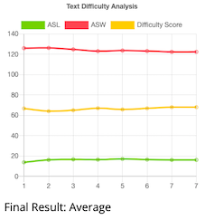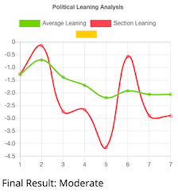

This program can even replace your grandchildren! How? Cuz unlike those ungrateful millenials, the _**"The Content Analyzer"**_  can keep you company and text you (semi-related articles based on random key words):

(Please note that I'm using a trial account, so that's why it looks annoying)

Hi, my name is **Jesse Lee** and I lowkey hate myself. That's why I decided to make this god-forsaken Google Chrome Extension, the most extra and convoluted thingy in the concievable universe. Want proof of my degeneracy? Just take a look at this stupid flowchart:

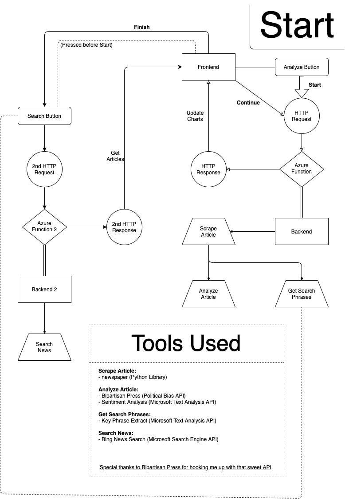
(Loser can't even make the chart non-crooked. The chart ain't just dummy thicc. It dummy.)

If you're a self-respecting human, you probably don't care about how this program works. With that said, allow me to explain how this program works. 

Basically, this program works by being fabulous. Or more acurrately, by being **F.H.A.B.** (the h is silent). Or even more acurrately, by implementing a **F.H.A.B.** structure. Or most acurrately but significantly less-cool-soundingly, by implementing a Frontend that makes a HTTP Request Trigger to an Azure Function Backend. The next couple of sections shall examine the story of how this program works. Afterwards, the tools and stuff to make this project work will be explored in detail, so you can also suffer the same pain I did.

## Google Chrome Extension
This program would not be possible if not for Google Extensions. First, the program loads up an html file, popup.html:

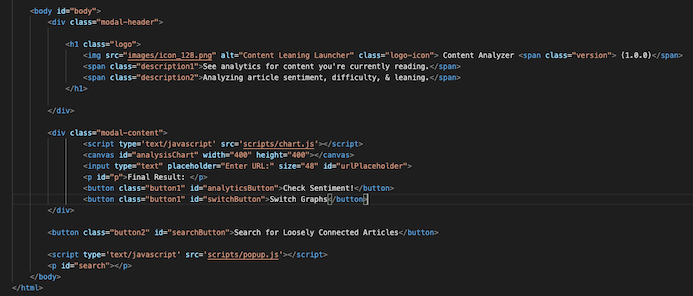

This serves as a visual interface. The background script, popup.js then loads. This is what creates the graphs in the program. The graphs are created by the popular javascript library, Chart.js. As the program is a Google Extension, it requires a special file, manifest.json: 

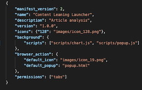 

This file details logistics to the Google Chrome browser. Additionally, this file enables us to get permissions to certain user information that we can sell in the black market. In our case, all we require is the permission, tabs, which allows us to get the url of the user's active tab.

## Frontend (Buttons)
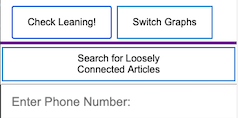

To get the graph to do its magic, The frontend communicates with the backend via an HTTP Request Trigger, which activates everytime someone presses the _"Get"_ ntton. When this button is pressed, a frontend script activates and starts to anaylze whatever the current type is. The type starts off with Sentiment, but can be adjusted via the _"Switch"_ button, which uses 2 variables (an array and an index) to get the type of analysis:

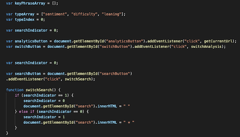

Finally, the _"Search"_ button sets a variable to 1 or 0. This variable will be passed as a param in the HTTP trigger to determine whether phrases should be extracted from the text. Additionally, after pressing the search button, you need to type in your phone number into the text input in order to tell the program where you are calling. We'll discuss this particular button later in the tutorial. In the meantime, let's use our wonderful imagination and imagine that I pressed the _"Search"_ button and also pressed the _"Get"_ button on this very long article. As soon as I press this button, the url is taken from the tab and passed as an argument into our first Azure Function caller.

## Frontend (analyseFunction())
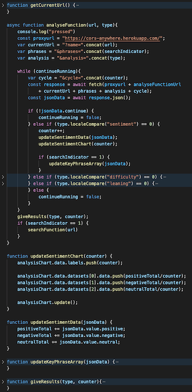

**Sidenote**: This function is asynchronous, meaning the rest of the program can exceucte while waiting for the results to come bac. Additionally, a proxy url is called first; this is due to certain policies within google extensions, which barrs the function.

To understand how this terribly designed function works, there's a couple of things we gotta understand. First, let's discuss what Azure Function and HTTP Triggers are. Basically, Azure Functions are these cloud computing thingys that allow you to do backend stuff without worrying about managing a physical server. These functions are called in a variety of ways, from an HHTP Tigger (GET request) to Timing Based. Our function is activated via an HTTP Trigger. In this particular function, there are 4 params (name, analysis, phrases, cycle) that are needed to be added to the endpoint to get stuff crackin'.

But before we discuss what each of the 4 params signify, there are 2 issues we gotta discuss first. One is the the idea of bottleneck, and the other is the idea of HTTP Responses. 

Bottlenecks are basically limitations given based on APIs we are using. In this program, there is a 10 item and 5120 character limit for each request on the sentiment analysis and phrase extraction APIS. Basically, this limit comes at play whenever we are trying to analyze a larger document. In order to bypass this problem, we can cut down long documents into digestable chunks for the API. 

However, we run into a second issue, limitations of HTTP Responses. Basically, an HTTP Response is what's given to a user when you make an HTTP Request. The issue is, each HTTP Request can only get ine Response; you cannot update it overtime. With the contradiciton between bottleneck and HTTP Reponse, the way to solve this is through a special param to track this.

Aight, we can finally talk about the params. Name is just the current url, analysis is the type of analyze we want to perform, phrases is an integer that you set to 1 if you want the function to extract search phrases (more on that later), and cycle is the special param I mentioned above. Cycle tracks how far within the article you are through an updating integer value. We can consistently update cycle by putting it in a while loop. Instead of trying to get multiple HTTP Responses, we focus on making multiple function calls instead. When we examine the backend, we'll see how it works in greater detail. For now, just understand that cycle is the key to us not sucking.

So what does the HTTP trigger do anyways? Well, curious reader, it returns a JSON object full of useful informational. Based on our current example, let's make an HTTP call to see what it returns. You can simply do this by plopping the endpoint + params into a google chrome browser (that's called a GET request, yayyyy).

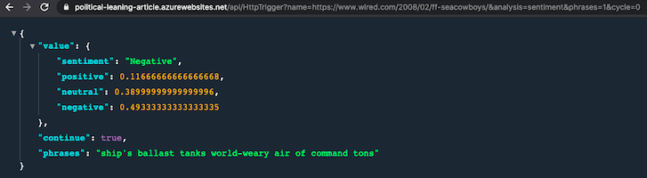

As you can see, the json data contains 3 distinct parts. First is value, which is a dictionary containing the results of the analysis. Then there's continue, which is a boolean value to let us know whether to continue running or not. This boolean value is what is used for in order to stop the while loop containing cycle. Finally, the phrases, which is a string full of key search words. The program uses value in order to update the chart.

After the function runs, the final result is written into the popup.html and ever value is reset to default.

## Backend(WebScrape.py)

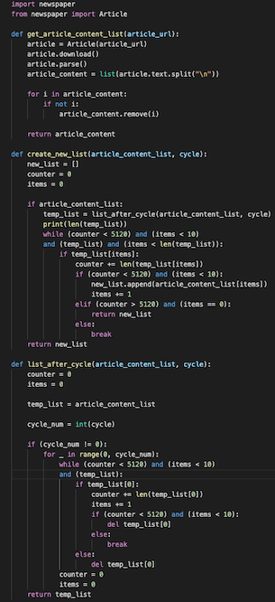

Let's finally talk about backend. To begin, once the params are passed over, they are utilized to update the values for the global variables. In the process, functions from the WebScrape.py file breaks the article down into chunks. The Python library, Newspaper (a more lightweight version of BeautifulSoup), takes in a url and returns a list. This list is then broken down by other functions until a analyzable list is created (right size). Above is the code used to accomplish this task; I'm gonna skip over the nitty gritty cuz the various loops and conditional statements have destroyed every remaining braincell in my body. Just understand that I designed that section like that in order to prevent a couple nasty edge cases.

## Backend(OOP & get_analytics)
After the unique document is generated, it's given to the get_analytics function to analyze. Unlike the frontend files, I actually did something pretty big brained and implemented an object class structure into my get_anaytics in order to get good. 

Basically, OOP, or object-orientated programming, is the idea of creating classes that share methods and attributes in order to save time. I implemented 2 big brained strats into this section to save time on designing and implementing future features. Look at this magical chart below, it details the relationship between my analyze types and a parent class of Analyze.

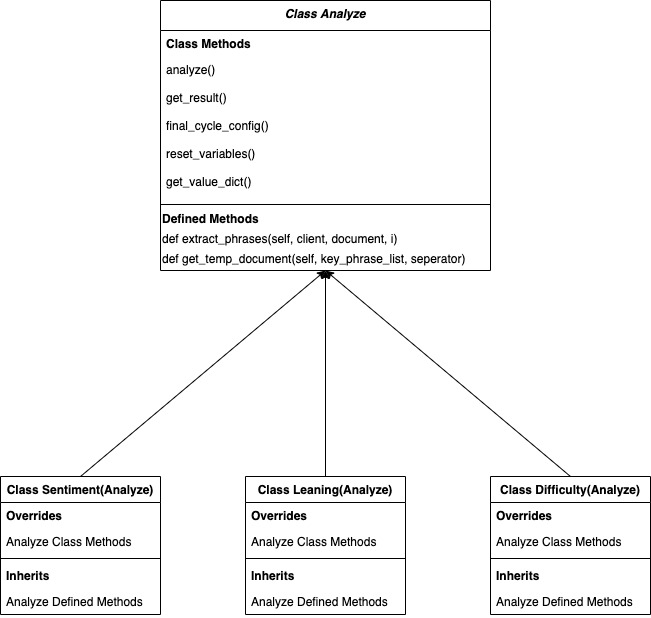

Essentially, I utilized the OOP concepts of Inheritance and Polymorphism to weasle out of writing conditional statements and seperate functions. By having a parental relation and overriding methods when needed, I can guarantee that a method does exist, even if I don't know the actual class. An example would be the a.analyse(client, document, i) line in the get_analytics function. Additionally, I utilized Inheritance in order to handle the get_phrases methods. This allows me to be able to create the get_phrases anywhere else, without being limited to this singular project.

## Backend(Analyze & key_phrase_list)
Analyze is a glorified abstract class:

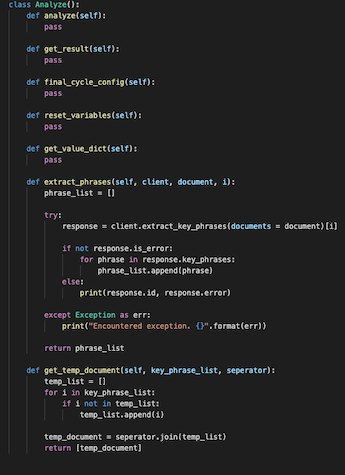

The only difference is that I added 2 actual methods to it last minute in order to create better code. By having Analyze handle key_phrase extraction, the code is a lot more concise and I can just call class objects for the functions.

Speaking of key phrases, I am using the Microsoft Text Analysis API, which is able to extract key phrases. The way the program is set up, the parent class, Analyze, possesses methods to help handle and shorten the list for phrases. These methods are only called when get_phrases (one of the params from the beginning), is true. Due to the nature of the API, extracting phrases often creates wayy too many to be utilized for search purposes. 

To solve this, I run the new list in the key phrase extract once. Proceeding this, in order to shorten key phrases to a more managable amount while also conserving resources, I utilize a random function to keep key phrases. Is that cheating? Perhaps. Is it a disappointment? Worse than finding out Santa isn't real. But in my defense, I'm like super broke, so I ain't about to run like 50 extra calls to get a more accurate list. And in my POV, the randomization just makes stuff cooler and more eccentric.

## Backend(Sentiment)
Let us now examine each of the Analyze children classes, starting with Sentiment. Sentiment analysis works by using the Microsoft Text Analysis. Not much to not about it lol. It's pretty cool I guess. Only minorly interesting thing is that I got lazy and just made all methods tha effected global variables into class methods. 

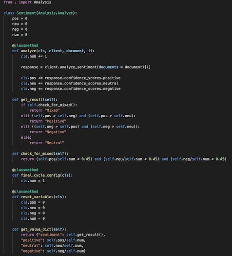

## Backend(Difficulty)
For this class, I just yoinked some code from stackoverflow to track sentences, words, and syllable counts. The difficulty analysis is based on the flesch reading test, which is pretty cool, high digits means it's easy, low digits means it's hard. You just plug stuff into a simple equation with some really janky numbers. The only thing to note is that I'm an idiot and my code should be slapped with a please do not try this at home sticker, as I tried to use self and cls in a class method. Basically, to keep it sweet and simple, this is terrible practice and I don't deserve rights.

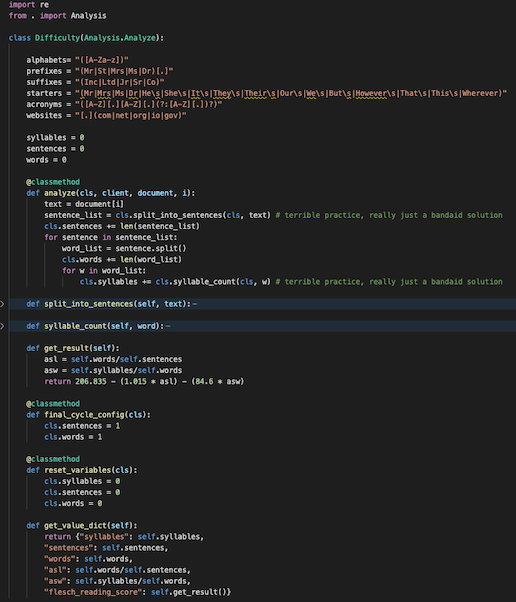

## Backend(Leaning)
This class was easy to set up thanks to everything else. The API I'm using to measure politcal leaning is from the non-profit organization, Bi-Partisan Press. Super cool of them to give me access, it's pretty fun to play with this API. It's a simple POST request which gets you the politcal leaning of texts. -42 to 42, negatives indicate left leaning.

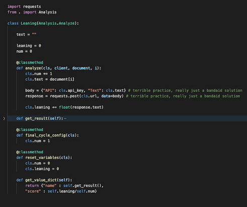

## Backend(get_json)
After analyzing everything, you set it to a variable dictionary, which is also a shared class method. Other than that, you just need to return the data as a JSON object, and reset all variables. The only other thing to note is that when the text list is empty, a function is called which sets the continue_running value (remember from wayyyy earlier) to false.

## Frontend(searchFunction)
After getting data from the backend and the analysis is completed, if the searchIndicator is true, then the phrases list will be converted into a string and passed into the another Azure Function. This other function is also an HTTP request. The params of this function are the url, phone number, & key word phrases.

## Backend(Azure Function 2)
The Bing News search engine API is first called to get semi-relevant news based on the phrase list. The response of this API gives 3 important infos. The first is the article title, second is url, and the final is a description. Once This information is saved, a quick call to the Twilio API sends these three pieces of information in segments to the requested number.

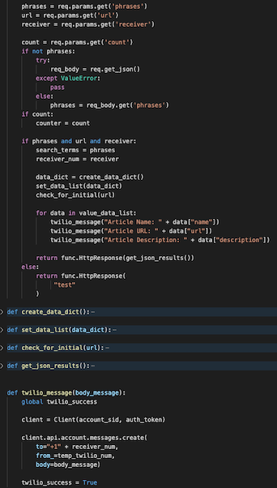

## Frontend(DONE)
You are told to check your phone and the messages should show up. 

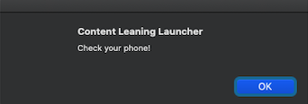

You're done. That's it. You can see your family now. Thanks for sitting through hell with me. If y'all are still confused, check out the source code ig. Otherwise, feel free to check out the promotional video to this post. Dope project, just super burnt out but relieved to actually have finished it.

